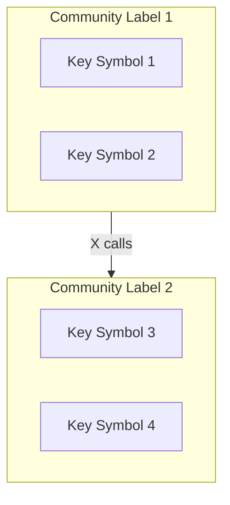

# Generate Architecture Map

Create a comprehensive architecture map of this codebase and save it to `ARCHITECTURE.md` with a mermaid diagram.

## Step 1: Read the Map Resource

Read the map resource to get the high-level overview:

```
noodlbox://$ARGUMENTS
```

This provides:
- Repository stats (communities, symbols, processes)
- Top communities with key symbols and entry points
- Cross-community flows (how modules connect)

## Step 2: Explore Key Communities

For each major community from Step 1, read its details:

```
noodlbox://$ARGUMENTS/community/{community_id}
```

This provides:
- All symbols in the community with centrality scores
- Entry points (symbols called from outside)
- Processes (execution flows)
- Connections to other communities

## Step 3: Trace Important Processes

For high-centrality processes, read the execution trace:

```
noodlbox://$ARGUMENTS/process/{process_id}
```

This provides:
- Step-by-step execution trace with file locations
- Related processes

## Step 4: Write Architecture Document

Create `ARCHITECTURE.md` in the repository root with this structure:

```markdown
# Architecture Overview

## Summary
[Brief description of what this codebase does based on community names and key symbols]

## Stats
- Communities: X
- Symbols: X
- Processes: X

## Modules

### [Community Label]
- **Purpose**: [Inferred from key symbols and processes]
- **Key Symbols**: [Top symbols by centrality]
- **Entry Points**: [How other modules interact with this]
- **Cohesion**: X.XX

[Repeat for each major community]

## Data Flows

### [Flow Name]
**From**: [Source Community] → **To**: [Target Community]
**Call Count**: X
[Description of what this flow does based on the symbols involved]

[Repeat for significant cross-community flows]

## Architecture Diagram


```

## Step 5: Generate Mermaid Diagram

Based on the cross-flows data, create a mermaid diagram showing:
- Each community as a subgraph with a sanitized ID and label
- Key symbols as nodes within subgraphs
- Cross-community calls as edges with call counts

**Mermaid Tips:**
- Sanitize IDs: Replace spaces/special chars with underscores
- Use short labels for readability
- Use `graph TB` for top-to-bottom or `graph LR` for left-to-right
- Add call counts on edges: `-->|47 calls|`
- Escape quotes in labels with `#quot;`

## Output

Save the complete architecture document to `ARCHITECTURE.md` in the repository root.
