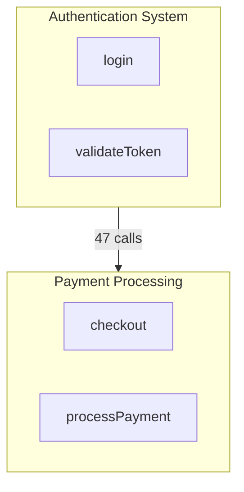

# Generate Architecture Map

Create comprehensive architecture documentation in `ARCHITECTURE/` directory with a main README and individual process files.

## Step 1: Check for Labels

Look for `.noodlbox/labels.json` in the repository:
- If exists: Use labels for module and process names
- If missing: Suggest running `/noodlbox:init` first, or proceed with auto-generated names

## Step 2: Assess Scale

Read the map resource:

```
@noodlbox:map://$ARGUMENTS
```

Check `stats.communities` to determine approach:

| Communities | Strategy |
|-------------|----------|
| < 10 | Generate inline - full exploration |
| >= 10 | Spawn codebase-analyst agent for isolated exploration |

## Step 3: Generate Content

### Small Codebase (< 10 communities)

Generate directly:

1. Read each community via `@noodlbox:map://$ARGUMENTS/community/{id}`
2. For top 3 communities by size, trace key processes
3. Build cross-community flow data from map overview
4. Create mermaid diagram from community connections

### Large Codebase (>= 10 communities)

Spawn the codebase-analyst agent:

```
Task: map_generation for $ARGUMENTS
Input: Map overview and labels (if available)
Output: Structured JSON with modules, processes, cross-flows
```

The agent handles scale-appropriate exploration and returns summaries.

## Step 4: Write ARCHITECTURE Directory

Create `ARCHITECTURE/` in repository root with this structure:

```
ARCHITECTURE/
├── README.md              # Main overview
├── {process-slug}.md      # One file per key process
└── ...
```

### README.md Structure

```markdown
# Architecture Overview

## Summary
[Brief description based on community labels and key symbols]

## Stats
- **Communities**: X modules
- **Symbols**: X functions, classes, etc.
- **Processes**: X execution flows

## Modules

### [Community Label]
**Purpose**: [Description from labels or inferred]
**Key Symbols**: Symbol1, Symbol2, Symbol3
**Cohesion**: X.XX

[Repeat for each major community]

## Data Flows

| From | To | Calls | Description |
|------|-----|-------|-------------|
| Module A | Module B | 47 | [What this flow does] |

## Key Processes

| Process | Entry Point | Description |
|---------|-------------|-------------|
| [Label](./process-slug.md) | FunctionName | Brief description |

## Architecture Diagram


```

### Process Files

Each `{process-slug}.md` contains:

```markdown
# [Process Label]

**Entry Point**: `FunctionName` in `src/path/to/file.ts:42`

## Description
[Description from labels or inferred from symbols]

## Execution Trace

1. `EntryPoint` (src/file.ts:42) - What this step does
2. `Step2` (src/other.ts:15) - What this step does
3. `Step3` (src/another.ts:88) - What this step does

## Cross-Community Connections

- Calls into: [Other Module]
- Called from: [Another Module]

## Related Processes

- [Related Process 1](./related-1.md)
- [Related Process 2](./related-2.md)
```

**Naming**: Slugify labels (e.g., "User Login Flow" → `user-login-flow.md`)

## Mermaid Diagram Tips

- Sanitize IDs: Replace spaces/special chars with underscores
- Use subgraphs for communities
- Add call counts on edges: `-->|47 calls|`
- Keep labels short for readability
- Use `graph TB` for top-to-bottom layout

## Output

Confirm completion with:
- Path to ARCHITECTURE directory
- Count of process files created
- Link to README.md
