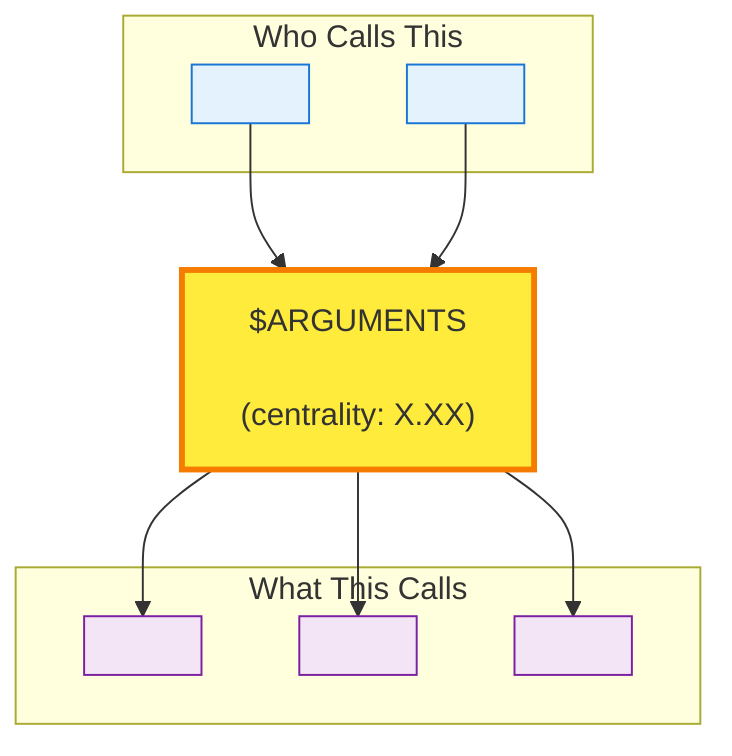

# Trace Feature: $ARGUMENTS

Follow this workflow to understand the complete execution flow and impact of this code symbol.

---

## Step 1: Find the Symbol

### Query: Locate all matching symbols
```cypher
MATCH (cs:CODE_SYMBOL)
WHERE cs.name CONTAINS '$ARGUMENTS'
RETURN cs.name, cs.kind, cs.file_path, cs.centrality, cs.signature
ORDER BY cs.centrality DESC
LIMIT 10
```

**What to look for:**
- Multiple matches? Pick the one in the right file/context
- Check `kind` (Function, Class, Method) to identify the symbol type
- Higher `centrality` = more important/widely used

**Select the correct symbol** and note its exact name for the next steps.

---

## Step 2: Understand Architectural Context

### Query: Which module does this belong to?
```cypher
MATCH (cs:CODE_SYMBOL {name: '<exact_name_from_step_1>'})
MATCH (cs)-[:PROCESS_STEP]->(p:PROCESS)
MATCH (p)-[:BELONGS_TO_COMMUNITY]->(c:COMMUNITY)
RETURN p.name as process, p.centrality as process_importance,
       c.name as community, c.size as community_size, c.cohesion
```

**Interpretation:**
- `process`: The business logic grouping this symbol belongs to
- `community`: The architectural module (feature area or layer)
- `cohesion`: How isolated this module is (0-1, higher = more isolated)

---

## Step 3: Who Calls This? (Upstream Dependencies)

### Query: Find all callers
```cypher
MATCH (caller:CODE_SYMBOL)-[:CALLS]->(cs:CODE_SYMBOL {name: '<exact_name>'})
RETURN caller.name, caller.kind, caller.file_path, caller.centrality
ORDER BY caller.centrality DESC
LIMIT 20
```

**Interpretation:**
- Many callers = widely used, high impact if changed
- Few callers = isolated, lower risk to modify
- High-centrality callers = critical entry points (APIs, main functions)

**Check for cross-module callers:**
```cypher
MATCH (caller:CODE_SYMBOL)-[:CALLS]->(cs:CODE_SYMBOL {name: '<exact_name>'})
MATCH (caller)-[:PROCESS_STEP]->()-[:BELONGS_TO_COMMUNITY]->(c1:COMMUNITY)
MATCH (cs)-[:PROCESS_STEP]->()-[:BELONGS_TO_COMMUNITY]->(c2:COMMUNITY)
WHERE c1 <> c2
RETURN c1.name as calling_from, c2.name as called_in, count(*) as calls
```

This shows which other modules depend on this symbol (architectural coupling).

---

## Step 4: What Does This Call? (Downstream Dependencies)

### Query: Find all dependencies
```cypher
MATCH (cs:CODE_SYMBOL {name: '<exact_name>'})-[:CALLS]->(called:CODE_SYMBOL)
RETURN called.name, called.kind, called.file_path, called.centrality
ORDER BY called.centrality DESC
LIMIT 20
```

**What to look for:**
- High-centrality dependencies = relies on critical infrastructure
- Many dependencies = complex implementation
- Cross-module dependencies = integration points

---

## Step 5: Multi-Hop Dependency Chain

### Query: Trace execution 2-3 levels deep
```cypher
MATCH path = (cs:CODE_SYMBOL {name: '<exact_name>'})-[:CALLS*1..3]->(dep:CODE_SYMBOL)
RETURN dep.name, dep.file_path, length(path) as depth, dep.centrality
ORDER BY depth, dep.centrality DESC
LIMIT 50
```

**Visualize as layers:**
- Depth 1: Direct dependencies (what this directly calls)
- Depth 2: Dependencies of dependencies
- Depth 3: Third-level (infrastructure layer)

**Filter to show only high-impact dependencies:**
```cypher
MATCH path = (cs:CODE_SYMBOL {name: '<exact_name>'})-[:CALLS*1..3]->(dep:CODE_SYMBOL)
WHERE dep.centrality > 0.5
RETURN dep.name, dep.file_path, length(path) as depth, dep.centrality
ORDER BY dep.centrality DESC
LIMIT 20
```

---

## Step 6: Impact Analysis

### Query: How many symbols would be affected by changes?
```cypher
// Direct callers
MATCH (caller)-[:CALLS]->(cs:CODE_SYMBOL {name: '<exact_name>'})
RETURN count(DISTINCT caller) as direct_callers

// Transitive callers (2 hops)
MATCH (caller)-[:CALLS*1..2]->(cs:CODE_SYMBOL {name: '<exact_name>'})
RETURN count(DISTINCT caller) as transitive_callers
```

### Query: Which communities would be affected?
```cypher
MATCH (caller)-[:CALLS*1..2]->(cs:CODE_SYMBOL {name: '<exact_name>'})
MATCH (caller)-[:PROCESS_STEP]->()-[:BELONGS_TO_COMMUNITY]->(c:COMMUNITY)
RETURN c.name, count(DISTINCT caller) as affected_symbols
ORDER BY affected_symbols DESC
```

**Interpretation:**
- High `direct_callers` = high impact, needs careful testing
- Multiple `affected communities` = cross-cutting change, needs coordination
- Low numbers = isolated change, safe to modify

---

## Step 7: Build Execution Flow Diagram

Create a Mermaid flowchart showing the execution path:



**Tips:**
- Use actual symbol names from your queries
- Add centrality scores in labels
- Color-code by module/community
- Add edge labels for relationship types (CALLS, etc.)

---

## Summary Analysis

Based on the queries above, answer these questions:

**Scope:**
- How many direct callers? ___
- How many transitive callers (2 hops)? ___
- How many communities affected? ___

**Complexity:**
- How many direct dependencies? ___
- Max dependency depth? ___
- Calls high-centrality code (>0.7)? Yes/No

**Risk Assessment:**
- **Low Risk**: < 5 callers, single community, low centrality dependencies
- **Medium Risk**: 5-20 callers, 2-3 communities, some high-centrality deps
- **High Risk**: > 20 callers, multiple communities, many high-centrality deps

**Recommendation:**
- Low risk: Safe to modify, basic testing
- Medium risk: Coordinate with affected teams, integration testing
- High risk: Careful planning, extensive testing, incremental rollout

---

**Use this analysis for:** Impact analysis, refactoring planning, feature documentation, onboarding new developers.
