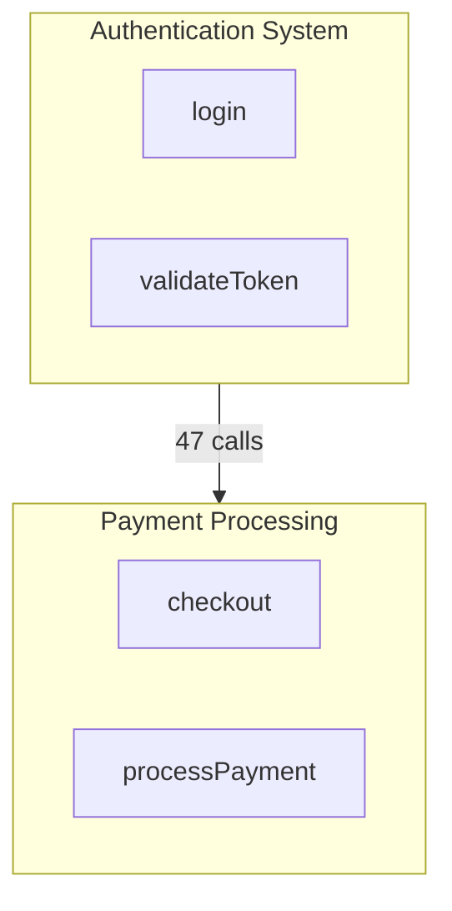

# Generating Documentation

Create architecture documentation from the code knowledge graph.

## Available Workflows

### /noodlbox:init

Generate human-readable labels for communities and processes.

Creates `.noodlbox/labels.json` with descriptive names.

### /noodlbox:generate_map

Generate comprehensive architecture documentation.

Creates `ARCHITECTURE/` directory with:
- `README.md` - Main overview with mermaid diagram
- `{process-slug}.md` - Individual process files

## Quick Start

```
1. Check for labels: Look for .noodlbox/labels.json
2. If missing: Run /noodlbox:init first
3. Then: Run /noodlbox:generate_map
```

## Workflow Checklist

### Generate Labels

```
Label Generation:
- [ ] Read map://current for community list
- [ ] For each community, identify purpose
- [ ] Generate descriptive labels
- [ ] Create .noodlbox/labels.json
- [ ] Verify labels make sense
```

### Generate Architecture Map

```
Architecture Map:
- [ ] Check for .noodlbox/labels.json
- [ ] Read map://current for overview
- [ ] Drill into top communities
- [ ] Generate mermaid diagram
- [ ] Write ARCHITECTURE/README.md
- [ ] Create process files
```

## Resources Used

### map://current

Get codebase overview with communities and cross-flows.

```
repository: my-project
stats: { communities: 15, symbols: 2400, processes: 890 }
communities:
  - id: abc123, label: PaymentProcessing, symbols: 47
cross_flows:
  - from: PaymentProcessing, to: UserAuthentication, calls: 12
```

### map://current/community/{id}

Get community detail with symbols and processes.

### map://current/process/{id}

Get full execution trace for a process.

## Mermaid Diagram Tips



**Guidelines**:
- Sanitize IDs: Replace spaces with underscores
- Use subgraphs for communities
- Add call counts on edges
- Keep labels short
- Use `graph TB` for top-to-bottom layout

For complete templates, see [templates.md](templates.md).

## Example: Generate Architecture Map

**Task**: "Document the architecture of this codebase"

```
Step 1: Check for existing labels
Look for .noodlbox/labels.json
→ Not found

Step 2: Generate labels first
Run /noodlbox:init
→ Created .noodlbox/labels.json with 15 community labels

Step 3: Read overview
READ map://current
→ 15 communities, 2400 symbols, 890 processes
→ Top communities: PaymentProcessing, UserAuthentication, DataAccess

Step 4: Explore key communities
READ map://current/community/{payment-id}
→ Key symbols: validatePayment, processCharge
→ Entry points: handlePaymentRequest
→ 12 processes

Step 5: Generate README
Write ARCHITECTURE/README.md with:
- Summary from community analysis
- Stats from map
- Data flows from cross_flows
- Mermaid diagram from communities

Step 6: Generate process files
For each key process:
- Read map://current/process/{id}
- Write ARCHITECTURE/{process-slug}.md
```

**Checklist**:
```
- [x] Check for .noodlbox/labels.json (not found)
- [x] Generate labels (/noodlbox:init)
- [x] Read map overview (15 communities)
- [x] Drill into top communities
- [x] Generate mermaid diagram
- [x] Write ARCHITECTURE/README.md
- [x] Create process files
```

## Output Structure

```
ARCHITECTURE/
├── README.md              # Main overview
├── checkout-flow.md       # Process: Checkout flow
├── user-login.md          # Process: User login
└── payment-processing.md  # Process: Payment processing
```

## When to Use Something Else

| Need | Use Instead |
|------|-------------|
| Explore code first | exploring-codebases skill |
| Check change impact | change-planning skill |
| Debug failing code | debugging skill |
| Plan refactoring | refactoring skill |
