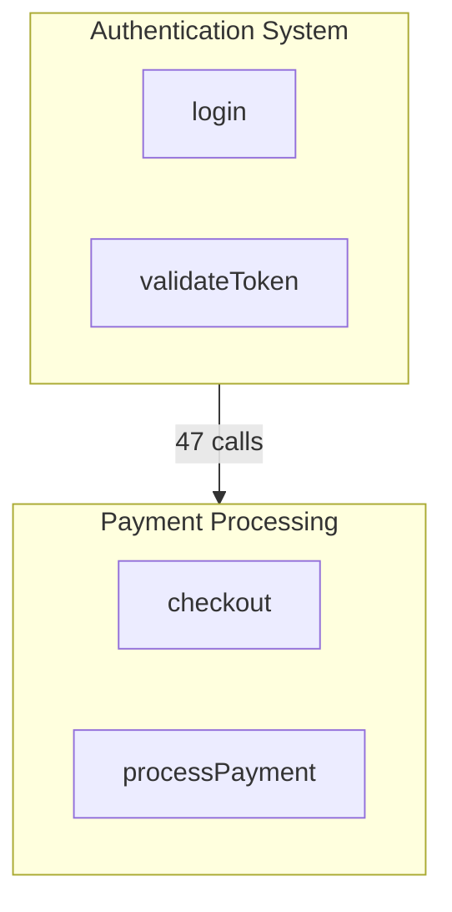
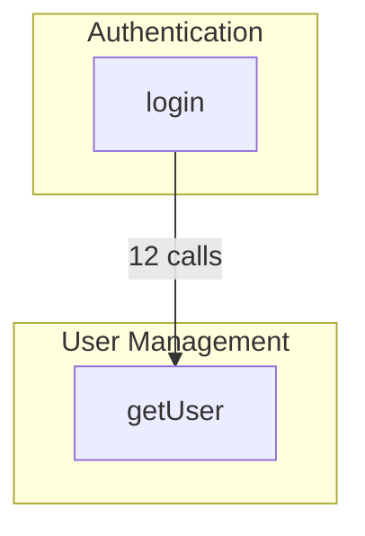

# Documentation Templates

Templates for architecture documentation output.

## README.md Template

```markdown
# Architecture Overview

## Summary

[Brief description based on community labels and key symbols]

## Stats

- **Communities**: X modules
- **Symbols**: X functions, classes, etc.
- **Processes**: X execution flows

## Modules

### [Community Label]

**Purpose**: [Description from labels or inferred]
**Key Symbols**: Symbol1, Symbol2, Symbol3
**Cohesion**: X.XX

[Repeat for each major community]

## Data Flows

| From | To | Calls | Description |
|------|-----|-------|-------------|
| Module A | Module B | 47 | [What this flow does] |

## Key Processes

| Process | Entry Point | Description |
|---------|-------------|-------------|
| [Label](./process-slug.md) | FunctionName | Brief description |

## Architecture Diagram


```

## Process File Template

```markdown
# [Process Label]

**Entry Point**: `FunctionName` in `src/path/to/file.ts:42`

## Description

[Description from labels or inferred from symbols]

## Execution Trace

1. `EntryPoint` (src/file.ts:42) - What this step does
2. `Step2` (src/other.ts:15) - What this step does
3. `Step3` (src/another.ts:88) - What this step does

## Cross-Community Connections

- Calls into: [Other Module]
- Called from: [Another Module]

## Related Processes

- [Related Process 1](./related-1.md)
- [Related Process 2](./related-2.md)
```

## Labels File Template

```json
{
  "communities": {
    "abc123": {
      "label": "Payment Processing",
      "description": "Handles payment validation, processing, and refunds"
    },
    "def456": {
      "label": "User Authentication",
      "description": "Manages user login, session tokens, and permissions"
    }
  },
  "processes": {
    "proc_123": {
      "label": "Checkout Flow",
      "description": "Complete checkout from cart to payment confirmation"
    }
  }
}
```

## Mermaid Subgraph Patterns

### Basic Community Subgraph

```mermaid
subgraph CommunityId["Community Label"]
    symbol1[Symbol 1]
    symbol2[Symbol 2]
end
```

### With Entry Points Highlighted

```mermaid
subgraph Auth["Authentication"]
    login[login]:::entryPoint
    validateToken[validateToken]
    refreshSession[refreshSession]
end

classDef entryPoint fill:#f96,stroke:#333,stroke-width:2px
```

### Cross-Community Edges



## Slugify Function

Convert labels to file-safe slugs:

```
"User Login Flow" → "user-login-flow.md"
"Payment Processing" → "payment-processing.md"
"API Gateway Handler" → "api-gateway-handler.md"
```

Rules:
- Lowercase
- Replace spaces with hyphens
- Remove special characters
- Add `.md` extension
